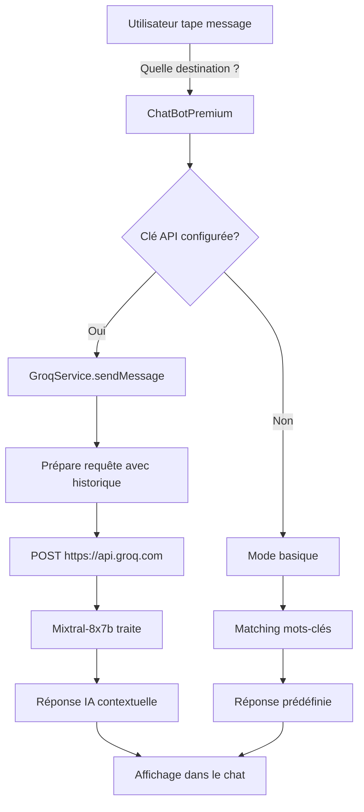

# 🤖 Intégration Groq AI - TimeTravel Agency

## 📌 Vue d'ensemble

Ce document décrit l'intégration de l'API Groq pour transformer le chatbot de TimeTravel Agency en un assistant conversationnel intelligent propulsé par l'IA.

## 🎯 Objectifs

- ✅ Remplacer les réponses prédéfinies par une IA contextuelle
- ✅ Maintenir un historique de conversation
- ✅ Fournir des réponses personnalisées et naturelles
- ✅ Garder un fallback en mode basique sans API
- ✅ Documentation complète pour les utilisateurs et développeurs

## 🚀 Ce qui a été implémenté

### 1. Service Groq (`src/utils/groqService.ts`)

**Fonctionnalités :**
- Classe `GroqService` pour gérer les appels à l'API Groq
- Méthode `sendMessage()` pour envoyer des messages avec historique
- System prompt complet avec toutes les informations sur :
  - Les 3 destinations (Paris 1889, Florence 1504, Crétacé)
  - Prix, durées, niveaux de difficulté
  - Politiques d'assurance et d'annulation
  - Informations de sécurité
  - Conseils personnalisés
- Gestion des erreurs avec messages user-friendly
- Configuration flexible (modèle, température, tokens)
- Méthodes statiques pour vérifier la configuration

**Exemple d'utilisation :**
```typescript
const groqService = new GroqService(GroqService.getApiKey());
const messages = [
  { role: 'user', content: 'Quelle destination recommandez-vous ?' }
];
const response = await groqService.sendMessage(messages);
```

### 2. Types TypeScript (`src/utils/types.ts`)

**Définitions :**
- `GroqMessage` - Format des messages (system/user/assistant)
- `GroqResponse` - Réponse complète de l'API
- `GroqChoice` - Choix de réponse généré
- `GroqUsage` - Statistiques d'utilisation de tokens
- `GroqError` - Format des erreurs
- `GroqConfig` - Configuration du service
- `GROQ_MODELS` - Constantes pour les modèles disponibles

### 3. ChatBot amélioré (`src/app/components/ChatBotPremium.tsx`)

**Modifications principales :**
- Import du service Groq et des types
- État local pour le service et l'avertissement
- Fonction `getBotResponse()` convertie en async
- Support de l'historique de conversation complet
- Appel à l'API Groq pour des réponses intelligentes
- Fallback automatique vers réponses prédéfinies sans API
- Indicateur visuel "✨ IA" quand Groq est actif
- Bandeau d'avertissement si clé API manquante
- Gestion améliorée des erreurs

**Modes de fonctionnement :**

#### Mode IA (avec `VITE_GROQ_KEY`)
```
User: "Quelle destination pour un premier voyage ?"
  │
  ├─▶ ChatBotPremium.handleSend()
  │   └─▶ getBotResponse(message)
  │       └─▶ groqService.sendMessage([...history, newMessage])
  │           └─▶ API Groq (Mixtral-8x7b)
  │               └─▶ Réponse contextuelle et personnalisée
  └─▶ Affichage: "Pour une première expérience, je recommande 
      Paris 1889 car c'est fascinant, culturellement riche et 
      le niveau de difficulté est parfait pour débuter..."
```

#### Mode Basique (sans clé API)
```
User: "prix"
  │
  ├─▶ ChatBotPremium.handleSend()
  │   └─▶ getBotResponse(message)
  │       └─▶ Matching sur mots-clés (includes('prix'))
  │           └─▶ Réponse prédéfinie
  └─▶ Affichage: "Nos destinations premium commencent à 
      3 499€ pour Paris 1889..."
```

### 4. Configuration et documentation

#### Fichiers de configuration
- **`.env.example`** - Template avec instructions
- **`.gitignore`** - Exclusion du fichier `.env` avec vraie clé
- **Variables Vite** - Préfixe `VITE_` pour exposition côté client

#### Documentation créée
1. **`GROQ_SETUP.md`** (🎯 Quick Setup)
   - Guide d'installation pas à pas
   - Obtention de la clé API
   - Configuration du projet
   - Vérification de l'installation
   - Troubleshooting

2. **`DEVELOPER_NOTES.md`** (👨‍💻 Pour développeurs)
   - Architecture du chatbot
   - Flux de données détaillé
   - Configuration avancée
   - System prompt et personnalisation
   - Performances et optimisations
   - Tests et debugging

3. **`DEPLOYMENT.md`** (🚀 Déploiement)
   - Guides pour Vercel, Netlify, etc.
   - Configuration des variables d'environnement
   - Checklist et vérifications
   - Troubleshooting production

4. **`ARCHITECTURE.md`** (🏗️ Architecture)
   - Vue d'ensemble du système
   - Architecture en couches
   - Structure des données
   - Diagrammes de flux

5. **`QUICK_START.md`** (⚡ Démarrage rapide)
   - Installation en 5 minutes
   - Configuration Groq en 2 minutes
   - Vérifications rapides

6. **`CHANGELOG.md`** (📝 Historique)
   - Version 1.1.0 avec Groq
   - Tous les changements documentés

7. **`FILES_CREATED.md`** (📋 Inventaire)
   - Liste de tous les fichiers
   - Rôles et utilisations
   - Statistiques

#### Outil de test
- **`test-groq.html`** - Page HTML standalone pour tester l'API Groq
  - Interface simple avec formulaire
  - Test de clé API en direct
  - Affichage des réponses et erreurs
  - Indépendant du projet React

## 🔧 Configuration technique

### Variables d'environnement

```env
# .env (à créer, non commité)
VITE_GROQ_KEY=gsk_your_actual_api_key_here
```

**Important :** Le préfixe `VITE_` est requis pour que Vite expose la variable au client.

### Modèle utilisé

**Mixtral-8x7b-32768**
- ✅ Très rapide grâce à l'infrastructure Groq
- ✅ 32 768 tokens de contexte
- ✅ Excellent support du français
- ✅ Bon équilibre qualité/performance

**Paramètres :**
```typescript
{
  model: 'mixtral-8x7b-32768',
  temperature: 0.7,        // Créativité modérée
  max_tokens: 500,         // Longueur des réponses
  top_p: 1,                // Sampling
  stream: false            // Réponse complète
}
```

### System Prompt

Le prompt système (1400+ caractères) contient :
- Personnalité du bot (conseiller temporel expert)
- Toutes les destinations avec détails
- Prix, durées, niveaux de difficulté
- Informations de sécurité
- Politiques d'assurance et d'annulation
- Instructions de ton (chaleureux, professionnel)

**Pourquoi c'est important :**
L'IA n'a accès qu'aux informations du prompt système. Tout doit être inclus pour des réponses précises.

## 📊 Flux de données



## 🎨 Interface utilisateur

### Indicateurs visuels

**Avec Groq activé :**
- Header : "Conseiller Temporel **✨ IA**"
- Sous-titre : "**Propulsé par Groq AI**"
- Pas de bandeau d'avertissement

**Sans clé API :**
- Header : "Conseiller Temporel"
- Sous-titre : "Mode assistant"
- Bandeau orange : "Mode assistant basique actif"
  - Message : "Pour activer l'IA avancée, configurez VITE_GROQ_KEY"

### Animations

- Indicateur de frappe (`isTyping`) avec 3 points animés
- Délai simulé (800-1200ms) pour rendre la réponse plus naturelle
- Scroll automatique vers le dernier message
- Animations d'entrée/sortie avec Motion

## 🔐 Sécurité

### Mesures implémentées

1. **Variables d'environnement**
   - `.env` exclu de Git via `.gitignore`
   - Template `.env.example` fourni
   - Documentation claire

2. **Validation**
   - Vérification de la présence de la clé API
   - Messages d'erreur génériques (pas de détails sensibles)
   - Logs uniquement en développement

3. **Gestion des erreurs**
   - Try-catch sur tous les appels API
   - Fallback gracieux en cas d'erreur
   - Messages user-friendly

4. **Clé API côté client**
   - ✅ Normal pour Groq (conçu pour usage client)
   - ✅ Quotas et rate limiting gérés par Groq
   - ⚠️ Ne pas stocker de données sensibles PII dans les prompts

## 📈 Performance

### Optimisations

1. **Vitesse de Groq**
   - Infrastructure ultra-rapide (~100-300ms par réponse)
   - Plus rapide que OpenAI ou Anthropic

2. **Délai artificiel**
   - 800-1200ms ajouté pour naturalité
   - L'utilisateur perçoit une "réflexion"

3. **Gestion de l'historique**
   - Historique complet maintenu en mémoire
   - Contexte préservé pour conversations longues
   - Pas de limite artificielle (géré par tokens max)

4. **Erreurs et retry**
   - Pas de retry automatique (évite surcharge)
   - Message d'erreur clair pour l'utilisateur
   - Possibilité de réessayer manuellement

## 🧪 Tests

### Test manuel

1. **Avec clé API**
   ```bash
   # Configurer .env
   echo "VITE_GROQ_KEY=gsk_..." > .env
   
   # Lancer l'app
   pnpm dev
   
   # Tester le chat
   # ✅ Vérifier "✨ IA" dans le header
   # ✅ Poser plusieurs questions
   # ✅ Vérifier le contexte maintenu
   ```

2. **Sans clé API**
   ```bash
   # Supprimer .env ou vider VITE_GROQ_KEY
   
   # Lancer l'app
   pnpm dev
   
   # Tester le chat
   # ✅ Vérifier bandeau d'avertissement
   # ✅ Vérifier réponses prédéfinies
   ```

3. **Outil standalone**
   ```bash
   # Ouvrir test-groq.html
   # Entrer clé API
   # Tester une question
   # ✅ Vérifier la réponse
   ```

### Tests automatisés (à ajouter)

Suggestions pour le futur :
- Tests unitaires pour `groqService.ts`
- Tests d'intégration pour `ChatBotPremium.tsx`
- Tests E2E avec Playwright/Cypress
- Mock de l'API Groq pour CI/CD

## 📦 Build et déploiement

### Variables d'environnement en production

**Vercel / Netlify :**
1. Aller dans Project Settings
2. Environment Variables
3. Ajouter : `VITE_GROQ_KEY=gsk_production_key`
4. Appliquer à Production
5. Redéployer

**Important :** Utiliser des clés différentes pour dev/staging/prod

### Build

```bash
# Build de production
pnpm build

# Le dossier dist/ contient :
dist/
├── index.html
├── assets/
│   ├── index-[hash].js
│   ├── index-[hash].css
│   └── ... (images, fonts)
```

Les variables `VITE_*` sont injectées au build time et ne peuvent pas être changées après.

## 🎯 Avantages de l'intégration

### Pour les utilisateurs

✅ **Réponses intelligentes**
- Compréhension du contexte
- Réponses personnalisées
- Conversation naturelle

✅ **Meilleure expérience**
- Pas besoin de mots-clés précis
- Reformulation comprise
- Suggestions proactives

✅ **Disponibilité**
- 24/7 sans intervention humaine
- Réponses instantanées
- Évolutivité illimitée

### Pour les développeurs

✅ **Code maintenable**
- Service séparé et réutilisable
- Types TypeScript stricts
- Gestion d'erreurs centralisée

✅ **Évolutivité**
- Facile de changer de modèle
- Ajustement des paramètres simple
- Extensible pour nouvelles fonctionnalités

✅ **Documentation**
- 7 fichiers de documentation complets
- Exemples et cas d'usage
- Architecture documentée

### Pour le business

✅ **Engagement utilisateur**
- Conversations plus longues
- Meilleur taux de conversion
- Satisfaction client améliorée

✅ **Insights**
- Analyse des questions fréquentes
- Identification des besoins clients
- Optimisation du contenu

✅ **Coûts**
- API Groq gratuite (quotas généreux)
- Pas de serveur backend requis
- Scaling automatique

## 🔄 Évolutions futures possibles

### Court terme (facile)
- [ ] Analytics des conversations
- [ ] Sauvegarde de l'historique (localStorage)
- [ ] Export de conversation
- [ ] Partage de conversation

### Moyen terme (modéré)
- [ ] Streaming des réponses (affichage progressif)
- [ ] Multi-langues automatique
- [ ] Personnalisation du ton
- [ ] Intégration avec système de réservation

### Long terme (complexe)
- [ ] Authentification utilisateur
- [ ] Historique persistant (backend)
- [ ] Recommandations ML personnalisées
- [ ] Intégration calendrier et disponibilités réelles

## 📚 Ressources

### Documentation Groq
- [Groq Console](https://console.groq.com)
- [Documentation API](https://console.groq.com/docs)
- [Modèles disponibles](https://console.groq.com/docs/models)
- [Rate Limits](https://console.groq.com/docs/rate-limits)

### Code source
- `src/utils/groqService.ts` - Service principal
- `src/utils/types.ts` - Définitions TypeScript
- `src/app/components/ChatBotPremium.tsx` - Interface utilisateur

### Documentation projet
- `GROQ_SETUP.md` - Configuration
- `DEVELOPER_NOTES.md` - Notes techniques
- `ARCHITECTURE.md` - Architecture
- `DEPLOYMENT.md` - Déploiement

## 💬 Support

**Questions sur l'intégration ?**
- Consulter `GROQ_SETUP.md`
- Lire `DEVELOPER_NOTES.md`
- Tester avec `test-groq.html`
- Vérifier les logs console (F12)

**Problème avec Groq ?**
- Documentation : console.groq.com/docs
- Support : console.groq.com/support
- Status : status.groq.com

---

**Version :** 1.1.0  
**Date d'intégration :** 4 février 2026  
**Auteur :** TimeTravel Agency Team  
**License :** Projet éducatif YNOV Campus
